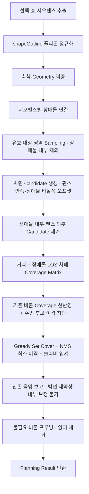

# Beacon Planning Engine — 통합 설계서 (Map Builder 연동)

> 이 문서는 아래 3개 문서를 통합·개선한 **단일 기준 문서(single source of truth)** 다.
>
> - `beacon_planning_engine_architecture.md` — 원론 아키텍처 제안
> - `beacon_planning_mapbuilder_integration_report.md` — 실제 코드 대조 분석
> - `beacon_planning_map_builder_integration_plan.md` — 상세 구현 계획
>
> 세 문서의 중복은 제거하고 상충점은 본 문서의 결정으로 일원화했다.
> 대상 구현: SafeRobo Dashboard 맵 빌더 (`/map-builder`, 2026-07 main 기준)
>
> 저장 데이터(DB 이전) 명세는 [map_builder_db_schema.md](./map_builder_db_schema.md) 참조.

---

## 0-A. 구현 현황 체크리스트 (2026-07-24 — 비콘 배치 리포트 구현 완료 기준)

> 구현 진입점: 맵 빌더 우측 상단 **[리포트]** → `/#/beacon-report`
> (지오펜스 카드 목록 + 상세 모달 + 배치 적용). §9의 "빌더 캔버스 내 통합"은
> **별도 리포트 페이지** 방식으로 대체 구현되었다.

### Phase별 상태 (§11 로드맵 대응)

- [x] **Phase 1 — 데이터 기반**: `BuilderMap.metersPerUnit`(구버전 1.25 승격),
  `BObstacle` + 팔레트(지오펜스 그룹 병합), 지오펜스 내부 배치 제한·소속 상속,
  이동·리사이즈·회전·삭제·지오펜스 동반 이동/회전/캐스케이드 삭제
- [x] **Phase 2 — Adapter·Geometry**: §5 계약 타입, 지오펜스/장애물/비콘 어댑터
  (`shapeOutline` 16세그먼트 정규화), Shoelace 면적·선분 교차·PIP — E2E로 검증
  (§12.2 워크드 예시 이론 36·육각 44 정확 재현)
- [x] **Phase 3 — Planning MVP**: 샘플링·Coverage Matrix·결정적 Greedy Set Cover.
  단 후보는 육각 격자가 아니라 **벽면 후보**(§6.1 변경) — 잔존 미커버는 음영으로 보고
- [x] **Phase 4 — 장애물 반영**: 내부 후보/샘플 제외, blocked LOS 차폐(정확),
  heavy/light 유효 반경 감쇠(0.55/0.85 단순화), 유효 면적 = 지오펜스 − 장애물
- [x] **Phase 5 — Worker·UI**: Vite 네이티브 워커, 진행률·취소·stale(requestId) 무시,
  리포트 헤더 설정(반경·목표 커버리지·기존 비콘 드롭다운, 변경 시 자동 재계산),
  카드/모달 결과 레이어(참고 반경 원·음영 점·AUTO 고스트·기존 에메랄드), 상세 모달
  줌/팬 + 반경·목표 시뮬레이션
- [x] **Phase 6 — 적용·대시보드 연동**: 상세 모달 [맵 빌더에 배치 적용] —
  제안 → `BSymbol`(BC-AUTO-nn, fenceId·층 상속) 커밋, 교체 모드 시 소속 기존 비콘
  제거, 적용 후 리포트 재계산·대시보드 자동 반영
- [ ] **Phase 7 — 성능 고도화**: 미착수 — 현 계산 6~38 ms로 §7.3 RBush 도입 기준
  (500 ms) 미달, 필요성 확인 전

### 설계 대비 의도적 단순화·차이 (문서 원안 → 구현)

| 항목 | 원안 | 구현 |
|---|---|---|
| UI 통합 위치 | 빌더 캔버스 내 Planning 레이어(§9) | **별도 리포트 페이지** + 상세 모달 (빌더는 진입 버튼만) |
| 후보 생성 | 육각 격자 | **벽면 후보**(지오펜스 안쪽·장애물 바깥쪽 오프셋 2 m) + NMS + 프루닝 (§6.1) |
| Hole 보정 | 내부 지점 추가 배치 | 벽면 제약상 불가 — **잔존 음영 보고** + 구조물 추가 유도 경고 |
| `BObstacle` 속성 | material·attenuationDb 포함 | **effect 3종만**(차폐/강한 감쇠/경미) — 재질·dB는 미도입 |
| 장애물 팔레트 | 전용 그룹 4종(m 단위) | 지오펜스 그룹 내 2종(직각/원형, 데모 unit 크기, 기본 blocked) |
| 장애물 소속 판정 | footprint 전체 포함 + invalid 상태 | **중심점 포함** 판정, 밖으로 이동은 차단, 지오펜스 삭제 시 함께 삭제 |
| 반경·목표 입력 | 자유 입력 | 공통 드롭다운 — 반경 15/20/35/50/100 m · 목표 80/90/95/98/100 % |
| 슬리버 임계 | (미정) | min(원판, 지오펜스) 샘플의 2% + NMS 이격 min(1.15×R_eff, 펜스 최장변/2) |
| 배치 적용 경로 | 빌더 `commit()`(Undo 포함) | 리포트에서 `saveBuilderMap` 직접 커밋 — 빌더 세션 Undo 이력에는 미포함 |
| `version: 2` 필드 | 도입 | 미도입 — `metersPerUnit` optional 승격으로 대체 (§10) |
| 결과 필드 | coverageSamples 포함 | 미포함(음영 홀만 균등 샘플 전송) + hexEstimateCount·sampleCount 추가 |

### E2E 검증 완료 항목 (§13 대응)

- [x] §12.2 워크드 예시 재현(이론 36/육각 44) · 동일 입력=동일 결과
- [x] 장애물 외부 드롭 거부, 소속·층 상속, 차폐 음영 발생, 벽면(펜스·장애물) 배치
- [x] 반경↑ ⇒ 수량↓·커버리지↑ 단조성 (15/20/25/30/35/50/100 m 스윕)
- [x] 좁은 통로(3 unit 밴드) × 대반경(50/100 m) — 임계 캡으로 정상 산출
- [x] 소형 펜스 × 100 m — 이격 캡으로 4벽 배치·코너 음영 해소(100%)
- [x] 기존 비콘 유지(선반영·에메랄드 표시)/교체 모드, 배치 적용 → 저장본 커밋 →
  빌더·대시보드 렌더 확인, 적용 후 재계산 시 기존 비콘 전환
- [ ] 회전·곡선 지오펜스 fixture 단위 테스트(§13 Geometry) — E2E 간접 검증만

---

## 0. 요약과 핵심 결정

**목표**: 맵 빌더에서 그린 지오펜스를 대상으로, 장애물을 반영해 **비콘 최적 수량·위치를
자동 산출**하고, 미리보기 후 확정하면 일반 비콘으로 커밋되어 관제 대시보드까지
자동 반영되는 Beacon Planning 기능을 구축한다.

**신규 개발의 중심은 Drawing UI가 아니라 계산 엔진이다.** 맵 빌더는 이미 폴리곤
(곡선 포함) 생성·편집, 지오펜스, 줌/팬/회전, 레이어, Undo/자동 저장을 갖추고 있다.

| 항목 | 결정 | 근거 |
|---|---|---|
| Drawing UI | 기존 SVG 맵 빌더 유지, **Konva.js 도입 안 함** | 드로잉·편집·핸들·레이어 완비, 결과 시각화도 SVG가 적합 |
| 좌표계 | **Local Cartesian** (1000×640 unit 기준 영역) | §3 확정 |
| 축척 | 맵별 `metersPerUnit` 저장 (기본 1.25 m/unit) | 하드코딩 상수를 저장 메타로 승격 |
| Geometry | 평면 Euclidean, **Turf.js 도입 안 함** | GeoJSON 아님. 핵심 프리미티브 다수 기보유(§2.2) |
| 장애물 UX | 팔레트에서 심볼처럼 배치 | 기존 드래그&드롭 UX 재사용 |
| 장애물 모델 | 독립 **`BObstacle`** + footprint (점 심볼 아님) | 면적·회전·감쇠 속성 필요 |
| 장애물 배치 제약 | 지오펜스 내부 + 동일 층 | 비콘 소속 규칙과 동일 패턴 |
| 계산 단위 | **층별 독립** | 지오펜스·비콘·장애물 모두 `level` 귀속 |
| 계산 Thread | **Web Worker** (진행률·취소 지원) | 계산 중 빌더 줌/팬/회전 유지 |
| 최적화 MVP | Greedy Set Cover + Hole 보정 | 결정적(deterministic) 동작 보장 §6.4 |
| 결과 저장 | **미리보기(비저장) → 사용자 확정 시에만** 비콘을 `elements`에 커밋 | Undo·자동 저장·대시보드 연동 재사용 |
| RBush | MVP 보류, 성능 기준 초과 시 도입 | §7.3 도입 기준 |

---

## 1. 배경과 범위

### 1.1 전제

- 기존 Map Builder의 SVG 기반 Drawing UI를 그대로 사용한다.
- 별도 Canvas/Konva.js 프레임워크를 추가하지 않는다.
- **지오펜스가 Planning의 대상 영역**이다.
- 장애물은 사용자가 팔레트에서 선택해 지오펜스 내부에 배치한다.
- 계산 결과는 즉시 저장하지 않고 **미리보기 후 사용자가 확정**한다.
- 계산은 **층별로 독립 수행**한다.

### 1.2 전체 구조

```text
┌──────────────────────────────┐
│      Map Builder (기존)      │  지오펜스·장애물·기존 비콘 편집
└──────────────┬───────────────┘
               │ Polygon / Scale / 기존 비콘        (adapter)
               ▼
┌──────────────────────────────┐
│   Beacon Planning Worker     │  Geometry · Candidate · Coverage
│                              │  · Optimization · Report
└──────────────┬───────────────┘
               │ Planning Result (진행률/취소 지원)
               ▼
┌──────────────────────────────┐
│      Map Builder (기존)      │  제안 비콘 ● / Coverage ◯ / Hole ░
│                              │  → [배치 적용] 시 일반 비콘으로 커밋
└──────────────────────────────┘
```

엔진은 **화면을 직접 그리지 않는다** — 순수 계산 결과만 반환하고,
시각화·커밋은 전부 맵 빌더가 담당한다.

---

## 2. 현재 Map Builder 현황 (전제 검증)

### 2.1 재사용 가능한 기능

| 현재 기능 | Planning 활용 |
|---|---|
| `rect` / `ellipse` / `poly`(곡선 정점) 지오펜스 + 회전 | 계획 대상 영역 |
| `shapeOutline()` | 모든 형태(곡선·회전 포함)를 **순수 폴리곤으로 정규화** — 엔진은 곡선/회전을 몰라도 됨 |
| `pointInOutline()` / `pointInShape()` | 후보·샘플 유효성 검사 |
| 층 필터와 `level` 모델 | 층별 Planning 분리 |
| 비콘 `BSymbol{fenceId, level}` 소속 규칙 | 확정 결과 저장 — 지오펜스 내부 배치·층 상속이 이미 강제됨 |
| SVG 레이어·범례 토글 | Coverage/Hole/제안 비콘 시각화 |
| Undo(50단계)·자동 저장 | 배치 적용·복구 |
| Web Mercator 위경도 앵커 | 실제 위치 연동 |

핵심 도메인 모델(`src/data/builder.ts`):

```text
BuilderMap { anchor, rotation, elements }
BElement = BBuilding | BRoom | BGeofence | BTunnel | BSymbol   (+ BObstacle 신설 예정)
```

### 2.2 기보유 지오메트리 자산 vs 신규 구현

| 기능 | 상태 | 위치 |
|---|---|---|
| Point in Polygon (레이캐스팅) | ✅ 보유 | `pointInOutline` — `builder.ts` |
| 폴리곤 정규화(곡선 샘플링+회전 bake) | ✅ 보유 | `shapeOutline` — `builder.ts` |
| 점-폴리라인 최단거리 / 점-선분 투영 | ✅ 보유 | `distToPolyline`, `snapDoorToWall` — `MapBuilder.tsx` (엔진으로 이관) |
| 회전 변환 / bbox | ✅ 보유 | `rotateOutline`, `rotateBPts`, `ptsBBox` |
| Polygon Area (Shoelace) | ❌ 신규 (~10줄) | `geometry/polygon.ts` |
| 선분–선분 교차 | ❌ 신규 (~15줄) | `geometry/intersection.ts` |
| Polygon Union / Difference / Buffer | ❌ **보류** | MVP는 지오펜스별 독립 계산으로 회피. 겹침 지오펜스 요구 시 `polygon-clipping`(~10 KB) 도입 |

### 2.3 보완이 필요한 3가지

1. **축척** — `M_PER_UNIT = 1.25`가 컴포넌트 상수로 고정. 저장 데이터에 축척이 없어
   맵별 보정 불가 → `BuilderMap.metersPerUnit` 승격 (§3, §10).
2. **장애물** — 전용 엔티티 없음. 점 좌표만으로는 선분 교차·차폐 계산 불가 →
   footprint를 가진 `BObstacle` 신설 (§4).
3. **계획 결과 상태** — 현재 비콘은 전부 "실제 설치"로 취급됨. 자동 배치 제안은
   확정 전까지 저장 대상 `elements`와 분리된 preview 상태로 관리 (§9.5).

---

## 3. 좌표계와 축척 (확정)

아키텍처 문서가 "가장 먼저 확인하라"고 지목한 항목의 **확정 답**:

```text
좌표계       : Local Cartesian (Case B)
기준 영역    : 1000 × 640 unit  (요소는 ±2000 unit 작업 여백까지 존재 가능)
축척         : 1 unit = 1.25 m  (기본값 — 실측 환산 시 기준 영역 = 1,250 m × 800 m)
지리 매핑    : 캔버스 중심 (500, 320) ↔ 위경도 앵커 (기본 37.3503, 126.9401 · 저장/편집 가능)
그리드 스냅  : 12 unit (= 15 m — 2026-07 그리드 15 m 통일)
거리         : 유클리드 √((x2-x1)² + (y2-y1)²) — 평면 좌표라 왜곡 없음
```

### 3.1 BuilderMap v2

```ts
export interface BuilderMap {
  version: 2
  anchor: { lat: number; lng: number }
  rotation: number            // 화면 보기 회전 — Planning 입력에는 적용하지 않음
  metersPerUnit: number       // 신규 — 기존 저장본은 1.25로 마이그레이션
  elements: BElement[]
}
```

- 캔버스 `rotation`은 **뷰 회전**이므로 계산과 무관하다.
  개별 요소의 `rot`은 `shapeOutline()`이 폴리곤에 이미 반영한다.
- 변환 공식:

```ts
distanceMeters = distanceLocal * metersPerUnit
areaM2         = areaLocal * metersPerUnit ** 2
radiusLocal    = radiusMeters / metersPerUnit
```

### 3.2 엔진 파라미터 환산표 (기본 축척 1.25 기준)

| 파라미터 | 실거리 | 로컬 좌표 |
|---|---|---|
| 비콘 반경 (기본 — 옵션 15/20/35/50/100) | 15 m | **12 unit** |
| 유효 반경 (safetyMargin 0.1) | 13.5 m | 10.8 unit |
| 샘플링 간격 | 1 m | 0.8 unit |
| 벽면 후보 간격 (R_eff/2) | 6.75 m | 5.4 unit |
| 벽면 오프셋 (WALL_OFFSET_U) | 2 m | 1.6 unit |
| 최소 이격 (NMS, min(1.15×R_eff, 펜스 최장변/2)) | 15.5 m± | 12.4 unit± |

> ⚠️ 1 unit = 1.25 m는 데모 스케일이다. 산출 수량은 축척 제곱에 비례해 틀어지므로
> 실도면 반입 시 배경 지도 타일 기준으로 **축척 검증·보정이 선행**돼야 한다.

---

## 4. 장애물(BObstacle) 설계

### 4.1 원칙

UI에서는 심볼처럼 배치하되, 도메인 모델은 **독립 `BObstacle`** 로 관리한다.

```text
사용자 경험 : 심볼 팔레트에서 드래그
렌더링      : 장애물 아이콘 + 반투명 footprint
계산 데이터 : polygon + 차폐/감쇠 속성
저장 모델   : BObstacle
```

기존 `SymbolType`에 추가하지 않는 이유: 기존 심볼은 점 설비지만 장애물은
너비·높이·회전·감쇠 등 **면적 기반 속성**이 필요하다.

### 4.2 데이터 모델

```ts
export type ObstacleMaterial = 'concrete' | 'metal' | 'equipment' | 'partition'
export type ObstacleEffect = 'blocked' | 'heavy' | 'light'

export interface BObstacle {
  id: string
  kind: 'obstacle'
  name: string

  fenceId: string          // 지오펜스 내부 배치 시 자동 설정
  level: number

  x: number                // 중심 좌표와 footprint
  y: number
  w: number
  h: number
  shape: 'rect' | 'ellipse'   // MVP는 직사각형·타원 — 다각형은 안정화 후
  rot?: number

  material: ObstacleMaterial
  effect: ObstacleEffect
  attenuationDb?: number
}

export type BElement = BBuilding | BGeofence | BSymbol | BTunnel | BRoom | BObstacle
```

### 4.3 팔레트 구성 (장애물 그룹 신설)

| 장애물 | 기본 형태 | 기본 크기 | 기본 효과 |
|---|---|---:|---|
| 콘크리트 구조물 | 직사각형 | 4 m × 4 m | blocked |
| 금속 설비 | 직사각형 | 3 m × 2 m | heavy |
| 대형 장비 | 타원 | 3 m × 3 m | heavy |
| 경량 칸막이 | 직사각형 | 4 m × 0.3 m | light |

표시 크기는 `metersPerUnit`으로 로컬 좌표 변환:
`localWidth = widthMeters / metersPerUnit`.

### 4.4 배치·편집 규칙

드롭 시 검증 순서 (비콘 소속 규칙과 동일 패턴 — `pointInShape` 재사용):

1. 드롭 좌표가 하나 이상의 지오펜스 내부인가
2. 현재 선택 층과 지오펜스 `level`이 일치하는가
3. **footprint 전체**가 지오펜스 내부에 들어오는가
4. 유효하면 `fenceId`·`level`을 지오펜스에서 자동 상속
5. 무효하면 저장하지 않고 안내 배너 표시 (기존 `showNotice` 재사용)

- 중첩 지오펜스 → **가장 작은 면적**의 지오펜스에 소속. 속성 패널에서 변경 가능하되
  동일 층 포함 관계를 만족해야 한다.
- 이동·리사이즈·회전 시 footprint 포함 검사를 재수행, 무효 편집은 마지막 유효 상태로 복귀.
- 지오펜스 이동/축소로 장애물이 밖으로 벗어나면 **자동 삭제하지 않는다** —
  `invalid` 상태로 표시하고 해당 층 Planning 실행을 차단해 사용자가 수정하게 한다.

---

## 5. Planning 데이터 계약

### 5.1 입력

```ts
export interface PlanningPoint { x: number; y: number }

export interface PlanningPolygon {
  id: string
  level: number
  points: PlanningPoint[]
}

export interface PlanningObstacle extends PlanningPolygon {
  fenceId: string
  effect: ObstacleEffect
  attenuationDb?: number
}

export interface PlanningBeacon {
  id: string
  x: number
  y: number
  level: number
  fenceId: string
  radiusMeters: number
}

export interface BeaconPlanRequest {
  requestId: string
  level: number
  geofences: PlanningPolygon[]
  obstacles: PlanningObstacle[]
  existingBeacons: PlanningBeacon[]
  metersPerUnit: number
  beacon: { radiusMeters: number }
  options: {
    targetCoverage: number             // 예: 0.98
    samplingResolutionMeters: number   // 예: 1
    safetyMargin: number               // 예: 0.1
    existingBeaconMode: 'keep' | 'replace'
  }
}
```

### 5.2 Adapter (UI 모델 → 계산 모델)

```text
BGeofence            → shapeOutline() → PlanningPolygon
BObstacle            → shapeOutline() → PlanningObstacle
BSymbol(type=beacon) → PlanningBeacon
```

Adapter 검증 항목: 정점 3개 이상 · 면적 > 0 · 자기 교차 없음 · 요청 층과 요소 층 일치 ·
장애물/기존 비콘이 소속 지오펜스 내부 · 좌표·축척이 유한한 양수.

### 5.3 결과

```ts
export interface BeaconPlanResult {
  requestId: string
  inputHash: string
  level: number
  totalAreaM2: number
  coveredAreaM2: number
  uncoveredAreaM2: number
  coverageRatio: number
  calculationMs: number

  theoreticalCount: number      // A / (πR²) 하한
  hexEstimateCount: number      // A / ((3√3/2)·R²) 육각 완전 커버 추정 (참고 지표)
  optimizedCount: number        // Greedy+NMS+프루닝 결과
  recommendedCount: number      // 안전 여유 반영 권장치 (+10%)

  proposedBeacons: PlanningBeacon[]
  sampleCount: number           // 전체 샘플 수 (coverageSamples 원본 전송은 폐기)
  coveredSampleCount: number
  holeSamples: PlanningPoint[]  // 음영 — 균등 다운샘플, 상한 2,500점
  warnings: string[]            // 예: "벽면 설치 제약으로 목표 커버리지 미달 …"
}
```

---

## 6. 계산 엔진 설계

### 6.1 Candidate — 벽면 설치 후보 (2026-07 변경)

> **변경**: 현장 제약상 비콘은 자유 공간이 아니라 **벽면에만 설치**된다.
> 초기 설계의 육각 격자 후보는 폐기하고 벽면 후보로 대체했다.

- 후보 = 지오펜스 외곽선 **안쪽** 오프셋(1.6 unit ≈ 2 m) + 장애물(구조물) 외곽선
  **바깥쪽** 오프셋 지점 — 간격 R_eff/2, 변 법선 양방향 중 유효한(펜스 내부·장애물 외부) 쪽 채택
- 결과적으로 지오펜스 중앙부는 도달 불가 → **음영으로 보고**되며,
  내부 구조물(장애물) 추가가 곧 설치면 확보·음영 개선 수단이 된다
- 중복 억제(2026-07): 신규 커버 < 원판 샘플 6% 이면 중단(슬리버 방지) +
  선택·기존 비콘과 **1.15 × R_eff 미만 이격 후보는 배제(NMS)** — 인접 원 겹침을
  원 면적의 ~30% 수준으로 제한. 선택 후 잉여 비콘 프루닝(§6.3 L)으로 최종 수량 최소화
- (참고) 기존 육각 격자 방식: 간격 √3 × R_eff, `pointInOutline` 내부 필터 —
  자유 배치가 허용되는 현장이 생기면 옵션으로 복원

### 6.2 Coverage — 판정 순서

각 (후보 비콘, 샘플 점)에 대해:

1. 같은 층인지 확인
2. 유클리드 거리 계산
3. 안전 여유 적용 유효 반경 이내인지 확인
4. 비콘–샘플 선분 주변 장애물 후보 검색
5. 장애물 polygon과 선분 교차 검사
6. 장애물 효과 반영해 최종 coverage 결정

장애물 효과 정책 (MVP):

```text
blocked → 해당 비콘이 그 샘플을 커버하지 못함        (정확 구현)
heavy   → 유효 반경 감소 또는 고정 감쇠               (설정값 기반 단순화)
light   → 작은 감쇠                                   (설정값 기반 단순화)
```

- 장애물 내부 샘플은 커버리지 **모집단에서 제외**한다:
  `유효 대상 면적 = 지오펜스 − 장애물 footprint 합`
- 샘플링은 캔버스 크기가 아니라 **지오펜스 bbox 기준** (요소가 기준 영역 밖에도 존재 가능).

### 6.3 Optimization Flow



> 구현: `engine.ts`의 `runPlan()` — 단계 K는 원안의 "Hole Gap 보정" 대신
> 잔존 음영을 수치·경고로 보고한다(벽면 설치 제약, §6.1).

### 6.4 결정성(Determinism)

동일 입력 → 항상 동일 결과. 후보 정렬·동점 처리 기준 고정:

```text
1. 신규 커버 샘플 수 내림차순
2. 지오펜스 경계로부터 거리 내림차순
3. y 오름차순
4. x 오름차순
```

---

## 7. 기술 선택 판정

### 7.1 Konva.js — 도입 안 함

빌더 SVG가 도면 렌더링·폴리곤 생성/편집·줌/팬·포인트/레이어 표시를 모두 지원한다.
결과 시각화(원/폴리곤/마커)도 SVG가 적합하다.

### 7.2 Turf.js — 도입 안 함

좌표가 GeoJSON(경위도)이 아닌 로컬 데카르트다.
`Euclidean Distance + Planar Polygon Geometry` 구성이 맞으며, §2.2의 기보유 자산 +
소량의 신규 함수로 충분하다. 의존성 없는 순수 함수라 워커 이식·단위 테스트가 쉽다.

### 7.3 RBush — 조건부 도입

MVP는 단순 배열 검색으로 **정확도부터 검증**한다. 아래 기준 초과 시 도입:

- Sampling Point 10,000개 이상
- Beacon Candidate 200개 이상
- 장애물 50개 이상
- 계산 시간 500 ms 이상 지속

도입 시 구조: `비콘-샘플 선분 bbox → RBush 검색 → 인접 장애물만 정밀 교차 검사`.
워커 내부에만 존재하므로 UI 번들 크기에 영향 없다 (~11 KB).

### 7.4 Web Worker — 도입

Vite 네이티브 워커(`new Worker(new URL('./worker.ts', import.meta.url), { type: 'module' })`).
계산 중에도 빌더 줌/팬/회전이 유지되고, 진행률 표시·취소가 가능해야 한다.

---

## 8. 모듈 구조와 Worker 프로토콜

```text
src/features/beacon-planning/          (구현 확정 — 2026-07)
├── types.ts            # §5 데이터 계약 + Worker 메시지 타입
├── adapter.ts          # BuilderMap → 지오펜스별 BeaconPlanRequest
│                       #   + 반경/목표 커버리지 공통 옵션 상수
├── engine.ts           # 파이프라인 전체(runPlan): Shoelace·선분 교차·PIP(빌더 재사용)·
│                       #   샘플링·벽면 후보·LOS 커버리지·Greedy+NMS·프루닝·음영 보고
├── worker.ts           # 워커 엔트리 (PLAN/CANCEL)
└── worker-client.ts    # 메인 스레드 클라이언트 (요청/진행률/취소/stale 무시)

src/pages/BeaconReport.tsx             # 리포트 페이지 — 지오펜스 카드·상세 모달(줌/팬·
                                       #   반경/목표 시뮬레이션)·배치 적용(preview → commit)
```

> 원안의 `coordinate.ts`·`geometry/`·`candidate.ts`·`coverage.ts`·`optimizer.ts` 분할은
> 총 구현이 ~460줄로 작아 `engine.ts` 단일 모듈로 통합했다. PIP·폴리곤 정규화는
> `builder.ts`의 기보유 순수 함수를 그대로 import 한다(§2.2).

Worker 메시지:

```ts
type WorkerRequest =
  | { type: 'PLAN'; request: BeaconPlanRequest }
  | { type: 'CANCEL'; requestId: string }

type WorkerResponse =
  | { type: 'PROGRESS'; requestId: string; phase: string; ratio: number }
  | { type: 'RESULT'; requestId: string; result: BeaconPlanResult }
  | { type: 'ERROR'; requestId: string; message: string }
  | { type: 'CANCELLED'; requestId: string }
```

무효화 규칙: 맵 빌더의 요소·축척·옵션이 바뀌면 기존 결과를 **stale** 처리한다.
새 요청 시작 시 실행 중인 이전 요청을 취소한다. 오래된(requestId 불일치) 결과는
화면에 적용하지 않는다.

---

## 9. Map Builder UI 연동

### 9.1 상단 툴바

- 장애물 팔레트 그룹 (또는 배치 도구)
- **비콘 자동 배치** 버튼
- Planning Layer 표시/숨김
- 계산 취소

### 9.2 Planning 설정 패널

대상 층 · 대상 지오펜스 · 비콘 반경 · 목표 커버리지 · 샘플링 간격 · 안전 여유 ·
기존 비콘 유지/교체 · 장애물 적용 여부.

지오펜스가 하나 선택된 상태로 실행하면 그것을 기본 대상으로 하고,
복수 대상은 Planning 전용 선택 상태로 별도 지원한다.

### 9.3 장애물 속성 패널

이름 · 소속 지오펜스 · 설치 층 · 재질 · 차폐 효과 · 감쇠값 · 실제 너비/높이(m) · 회전각.
층·소속은 배치 시 자동 설정, 유효 범위에서만 변경 가능.

### 9.4 결과 레이어

권장 SVG 렌더 순서:

```text
지도/Grid → 건물/작업영역 → 지오펜스 → 장애물 footprint
→ Coverage → Coverage Hole → 제안 비콘 → 확정 심볼 → 선택/편집 핸들
```

| Layer | 표현 |
|---|---|
| 장애물 | 재질 아이콘 + 반투명 footprint |
| Coverage | 반투명 원 또는 sample heat layer |
| Coverage Hole | 경고색 점 또는 hatch |
| 제안 비콘 | 점선 테두리 + AUTO 배지 (고스트) |
| 기존 비콘 | 현재 비콘 스타일 유지 |

> Coverage 원은 장애물 차폐를 정확히 표현하지 못하므로 **참고용 반경**으로만 표시하고,
> 실제 커버 여부는 coverage sample/heat layer로 표현한다.

### 9.5 결과 적용 (preview → commit)

```ts
const [planningResult, setPlanningResult] = useState<BeaconPlanResult | null>(null)
```

- 결과는 React preview 상태에만 존재 — **저장 데이터 불변**.
- [배치 적용] 시 제안 비콘을 기존 `BSymbol`로 변환해 `commit()`으로 반영:

```ts
{
  id: newId(), kind: 'symbol', type: 'beacon',
  name: 'BC-AUTO-01',
  x: proposal.x, y: proposal.y,
  level: proposal.level, fenceId: proposal.fenceId,
  source: 'planner',
}
```

- 기존 `commit()` 사용 → **Undo·자동 저장에 자동 포함**.
- 취소는 preview 상태만 제거.

**결정적 장점**: 확정 비콘은 기존 비콘-지오펜스 소속 규칙·siteModel 파이프라인을
그대로 타므로, **관제 대시보드 2D/3D와 비콘 관리 테이블에 추가 개발 없이 반영**된다.

---

## 10. 저장과 마이그레이션

- 저장 키 유지(`builder-map-v1`), `version: 2` 필드 기반 마이그레이션:
  구버전 저장본은 `metersPerUnit = 1.25, version = 2` 기본값으로 승격.
- Planning preview·coverage sample·진행률은 **저장하지 않는다**.
  확정 비콘과 장애물만 저장한다.
- 대시보드(siteModel) 변환:
  - 확정 비콘 → 기존 `mapBeacons`·`beaconRows`에 포함 (기존 경로 그대로)
  - 장애물 → 초기에는 빌더/엔진 전용. 관제 지도 표시가 필요해지면 `SiteObstacle`로 별도 변환

---

## 11. 구현 로드맵

> 착수 원칙: **알고리즘보다 데이터 기반 먼저.** 입력이 안정되면 계산 오류를
> UI/좌표 문제와 분리해 검증할 수 있다.
> 참고: 면적 기반 수량 추정(§12)만으로도 1차 견적 리포트가 가능하므로,
> Phase 2 완료 시점에 조기 데모를 만들 수 있다.

| Phase | 상태 | 내용 | 완료 기준 |
|---|---|---|---|
| **1. 데이터 기반** | ✅ 완료 | `metersPerUnit` 승격(`version` 필드는 생략), `BObstacle`+팔레트, 지오펜스 내부 배치 제한, 이동·리사이즈·회전·삭제 | 장애물이 지오펜스 내부에만 배치되고 층·ID를 상속하며 footprint가 2D/3D와 일치 |
| **2. Adapter·Geometry** | ✅ 완료 | 입출력 타입, 지오펜스/장애물/비콘 Adapter, 거리·면적·PIP·선분 교차 (단위 테스트 대신 E2E fixture 검증) | 모든 빌더 형태가 계산 폴리곤으로 일관 변환, §12.2 수치 재현 |
| **3. Planning MVP** | ✅ 완료 (벽면 후보로 변경) | 벽면 Candidate(§6.1), Sampling, Coverage Matrix, Greedy Set Cover+NMS, 음영 보고 | 목표 coverage 재현(도달 가능 범위), 동일 입력=동일 결과 |
| **4. 장애물 반영** | ✅ 완료 | 내부 Candidate/Sample 제외, blocked LOS 차폐, heavy/light 반경 감쇠(단순화) | 장애물 뒤 샘플이 잘못 커버되지 않음 — E2E 음영 확인 |
| **5. Worker·UI** | ✅ 완료 (리포트 페이지 방식) | 워커+진행률/취소, 헤더 설정(자동 재계산), 카드/모달 결과 레이어, 상세 줌·시뮬레이션 | 계산 중 UI 유지, 취소·stale 결과 미적용 |
| **6. 적용·대시보드 연동** | ✅ 완료 | 제안→`BSymbol`(BC-AUTO) 커밋, 유지/교체 정책, 대시보드 자동 반영 | 적용 전 저장 불변, 적용 후 확정 비콘 대시보드 표시 |
| **7. 성능 고도화** | ⬜ 미착수 | union/difference 검토, RBush, sample 압축, 대용량 측정 | §12 성능 기준 — 현재 6~38 ms로 도입 기준 미달, 보류 |

---

## 12. 수치 참고

### 12.1 수량 추정 공식

```text
이론 하한          : A / (πR²)
육각 격자 완전 커버 : A / ((3√3/2)·R²)     (격자 간격 √3·R)
```

### 12.2 샘플 지오펜스 워크드 예시 (R=15 m, margin 0.1 → R_eff 13.5 m)

| 지오펜스 | 크기(unit) | 실면적 | 이론 하한 | 육각 배치 |
|---|---|---|---|---|
| 소화조 가스 위험구역 (지상 1층) | 135×120 | 25,313 m² | 36개 | 44개 |
| 전처리조 밀폐구역 (지하 1층) | 200×120 | 37,500 m² | 54개 | 65개 |

수량이 커 보이는 것은 데모 축척 때문이다(§3 경고). 소화조 구역 샘플링(1 m)은
약 2.5만 점으로 워커 예산 내.

### 12.3 성능 기준 시나리오

```text
지오펜스 10개 · 장애물 100개 · 후보 500개 · Sampling Point 20,000개
```

목표: 메인 스레드 장시간 블로킹 없음 · 진행률 갱신 · 취소 응답 ·
워커 메모리 측정 및 coverage matrix 상한 설정.

---

## 13. 테스트 계획

**Geometry** — 직사각형/타원/오목 폴리곤, 회전된 지오펜스·장애물, 곡선 정점 폴리곤,
경계에 닿는 장애물, footprint 일부 이탈, 자기 교차 폴리곤.

**Planning** — 장애물 없는 단일 지오펜스, 중앙 콘크리트 장애물, 다수 금속 설비,
중첩 지오펜스, 같은 좌표의 다른 층, 기존 비콘 유지/교체 모드.

**UI/통합** — 외부 드롭 거부, 이동 후 재검증, 지오펜스 축소 후 invalid 표시,
계산 중 요소 변경 시 결과 폐기, preview 취소 시 저장 불변, 적용 후 Undo,
새로고침 복원, 대시보드 비콘 목록 반영.

---

## 14. 리스크와 미결정 사항

### 리스크

1. **축척 신뢰성** — 산출 수량이 축척 제곱에 비례. 실도면 반입 시 축척 검증 필수.
2. **층 교차 금지** — 후보·샘플·커버리지는 반드시 `level` 단위 분리 (데이터 규칙과 일치).
3. **곡선 근사 오차** — `samplePoly` 기본 8세그먼트. 면적 정밀도가 중요하면 엔진 입력
   시에만 16으로 상향.
4. **낙관적 수량 경고** — 지오펜스가 건물 내부인 경우(밀폐구역 등) 내벽 정보가 없어
   감쇠 없이 계산됨 → `warnings`에 명시해 리포트에 노출.
5. **작업 범위** — 요소가 기준 영역 밖(±2000 unit)에 존재 가능 — 샘플링은 지오펜스
   bbox 기준으로.

### 미결정 → 확정 현황 (2026-07-24)

1. `metersPerUnit` 입력 UI 위치 — **여전히 미결**: 저장 필드·마이그레이션은 구현,
   편집 UI는 없음(기본 1.25 고정). 위경도 앵커 팝오버 통합안 유지.
2. Coverage 시각화 방식 — **확정**: 참고용 반투명 반경 원 + 음영(미커버) 샘플 점
   (균등 다운샘플, 상한 2,500점). heat layer는 도입하지 않음.
3. 관제 대시보드의 장애물 표시(`SiteObstacle`) — **구현됨**: siteModel 변환 +
   관제 2D(Obstacle2D footprint)·3D(볼륨) + 레이어 토글.
